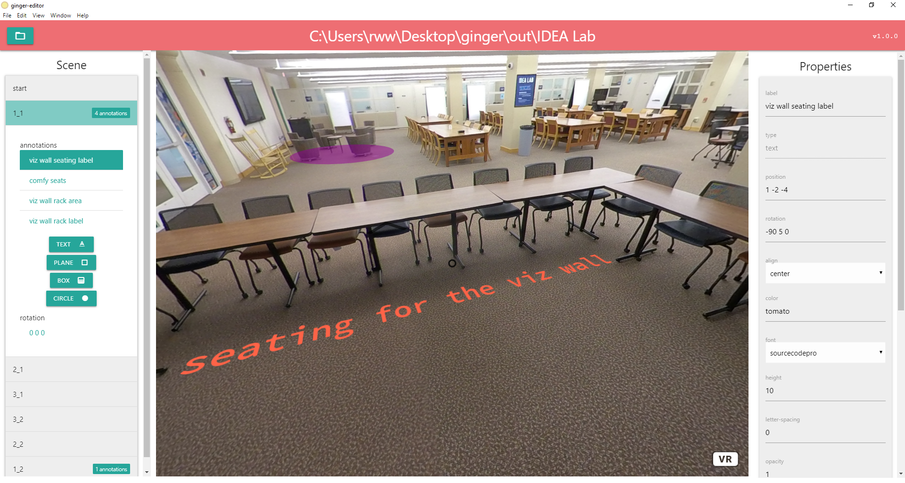

## Ginger includes
- ```ginger``` a command line tool to generate web-embeddable 360/VR tours from a directory of 360 photos. 
- ```Ginger Editor``` a desktop application to edit, annotate, and preview the tours. 

## Usage
```
./ginger.exe -p /path/to/images/ -t "My Tour Title"
```
## Flags
```
-c  Number of columns in the layout matrix (see below)
-o  The output location of generated files
-p  Path to the directory of 360 images to be used
-r  Reverse the order of images in the target directory
-s  Serve the output to preview in a web browser
-t  Custom title to be displayed on the loading page
```

## Layout matrix
Ginger parses the images in the target directory based on the 'layout' you give it. 
For example, to create a tour of a space from 9 images, you would capture them in this order:

```
-------------
| 1 | 6 | 7 |
-------------
| 2 | 5 | 8 |
-------------
| 3 | 4 | 9 |
-------------
```
You would then indicate that your layout matrix has 3 columns: 
```
./ginger.exe -p nine_images/ -t "My 9 image tour" -c 3
```

## Dev server
To use the -s (serve) argument, you must first generate self-signed certificates. You can use the cert.sh script to do this. 
```
chmod +x cert.sh
./cert.sh
```

## A-frame
We use the [A-frame](https://github.com/aframevr/aframe) WebXR library to create web-embeddable VR tours.

## Ginger Editor
A desktop application that allows you to add text and geometric annotations to ```ginger``` tour packages, as well as tweak image orientations and tour starting place. Pre-built binaries for Windows, Mac OSX, and Linux will be available. 
